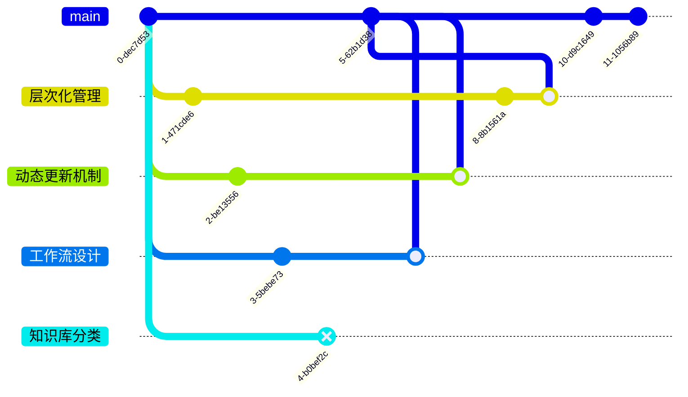

## 简介

按照时间轴记录从开始到结束过程中遇到的各种问题以及天马行空的想法。在特殊节点将会被添加至索引。

## 正文

---
（2024-11-22) -->

最近在尝试学习使用 `Admin.NET 框架` ，然后准备为这个的学习做一些记录甚至形成一些具有引导性质的文章。在完成一个配置步骤记录之后发现**我的各类文章杂杂又乱乱管理难度相当高**，于是着手构思修改我的知识库架构。

---
（2024-11-23) -->

在与 GPT 交流的过程中有了解到 [[K-1-Zettelkasten|Zettelkasten]] 卡片盒理论，正好最近学习了解了架构设计，对这种细分卡片达到解耦目的的做法非常感兴趣！于是准备基于它去完成我的知识库架构设计。

设计了三种；
- 问题
- 知识
- 文章

预期的效果是，文章中可以提出问题，然后引出到问题卡片中。问题卡片可以再次提出问题，也可以引用到知识卡片。

考虑到不同文章的内容范围有大有小，可能一个文章会组织多个文章的内容，于是尝试思考如何去处理。

---
（2024-11-24) -->

正好在研究[[Q-1-如何记录和总结与 AI 对话中的有效信息？|如何记录和总结与 AI 对话中的有效信息？]]，正好提出问题：[[Q-2-如何设计一个知识库架构来组织对话和知识？|如何设计一个知识库架构来组织对话和知识？]]并且思考设计了一套[[Q-3-如何设计一个卡片盒中卡片的命名规范|命名规范]]。

以 字母-数字-标题 的形式完成大部分的命名，其中字母是类别。


---
（2024-11-26) -->

因为同时在研究 模型的本地化部署和向量数据库 相关内容，有些内容可能不是正式的形式但是确实是一个需要多个文件并且组织的。以及我还需要一个能够自由发散思维记录的地方。

于是新增卡片：
- `创意草稿`
- `思维随笔`

询问 GPT 后它额外推荐了这几个：
- `实验记录`
- `研究笔记`

说是我的实操部分可以放在 `实验记录` 内，`研究笔记` 中能够更为规范。

嘛，`实验记录` 那个我觉得挺好的，无论是成功还是失败，任何需要实操的内容都可以写进去。这样的话，其他文本内就无需写那么多内容，当读者有这个需求的时候自然能够跳转或者预览我的 `实验记录`～

`研究笔记` 这个……感觉有点不够接地气，但还是先留着吧～反正短时间内不会用到它。

形成了目前七种卡片的模板创建（仅限于创建！！内容还没想好呢～）

根据对它们七个的定义，将对应的介绍放到了 `知识盒` 内，形成了七条记录～

大概是这样的：

```
概述
正文
	1. 命名规范
		- 命名规则
		- 示例文件名

	2. 适用场景
	3. 结构化记录

```


对于读门户卡片类型：
- `探索历程`
- `结论摘要`

一个是详解包括我的思路变化、当时的想法，一个是略解包括整体的目标呀、正确的步骤之类的。不同类型的读者能够根据需求去获取我的思路 或者 直接得到结果。

---
（2024-11-27) -->

重新考虑 `探索历程` 的功能发现，貌似我的 `结论摘要` 类型的文章本身就能引用其他类型的卡片，也就是说读者根本不需要我去为他们分别做两个文章来区分用途。

`探索历程` 改为记录一个项目或者一个单篇的所有动作、修改，以及一些思路上的或者其他零零碎碎的东西（也就是这一篇这样的玩意儿）～不过这一篇是现在回忆着写的，前面啥时候做的架构设想一类的玩意儿我实在是记不起来了！！

倒是这个 `创意草稿` 非常有意思，预期中它是一个**实际项目的前置版本**，能够进化成项目！！
我希望它能够有 git 那种的，**分支**、**合并**、**迁出**一类的功能。对于一个创意而言，多个分支很难看出当前的状态，所以我设计了一个 **ID-x-Gate-xxx 作为门户文章**，里面记录着 ID-x-xxx 目前的状态。

现在用 GPT 大概生成了一个模板来着，这里能够帮助读者快速了解所有信息、当前活动分支、当前目标、待解决问题之类的，可以当作一个看板来看待它～


还设计了一个 ID-x-Log-xxx 能够简略记录每一天在这个想法 or 项目中的动作，**包括这个ID中的任何分支动作**。


当然，目前记录的这些分支肯定会做修改的，这些个都是 GPT 生成的小玩意儿。

---
（2024-11-28) -->

可算基本把记录给补好了……说实话纯去回忆真的有点头皮发麻！！从今天开始应该就是实况记录了！！

修改笔记属性，删除 `related_xxx` 系列属性，进一步降低写文章的门槛。 

把原来的 ID-创意草稿 的内容变更正常了！就是正常的那种可以随便记录的临时小想法，能够组织起来形成项目～然后之前对它的设定 放到了 **项目实践** 中。啊啊啊啊调整这些真的是头大！！！

尝试使用 mermaid 来绘制 git 图，以图表的形式吸引读者，也方便阅读。比如：


当然，目前这个分支是瞎分的，就是意思意思而已～这个图看起来分支的变化关系就很明朗了！

---
（2024-11-29) -->

现在有一个问题，分支部分应该如何去记录信息？目前的分支中只有3个部分：
- 目标
- 进展
- 待解决问题

分支的目标是将某个大问题切成多个小方向去分别验证是否能够实现。分支中以一天为基本单位，将新增问题、解决问题这两个动作的所有内容简单记录为一个 commit 。合并回主分支则额外算一个commit。

啊啊啊啊，这个分支设计好痛苦啊！！就今天想着建立两个项目来着，一尝试就发现问题了……

分支部分的定位应该和Gate类似，都是一个 kanban 类型的东西，只不过增减的内容应该保存。为什么增加、为什么删除，这两个部分的原因也需要详细说明。

这里又有一个问题，对于分支部分的思考应该放在什么类别？

那必须是放到问题盒里面去啊！刚才脑子糊了，不管问题在问题盒子里面排第几个，只要它是被这个文件引用的，那在关系图谱中它们就是直接关联的！这个问题也是属于这个项目的！

正好顺着这个思路，像那种陈述句类型的怎么办？它又不像实操，又不像问题……或许能够直接作为一篇文章来写？链上来源貌似还真可以～嗷嗷！直接tag上加项目/项目名称就好了！我真是个小机灵鬼～到时候展示这个文章也能够从这个文章向前检索！

好好好，我又知道了！对于每个项目中的变化，我直接在这里记录，然后一天结束以后再逐个看看，把对应的信息加上去～比如，晚上再去对这这个加减分支，修改内容～

---
（2024-12-04) -->

新增随笔模板。短期内应该不会怎么调整整体的架构了。
